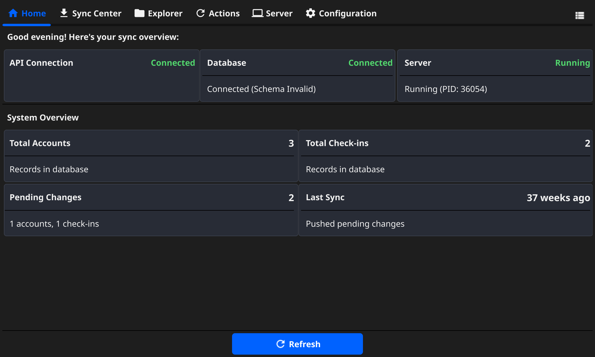
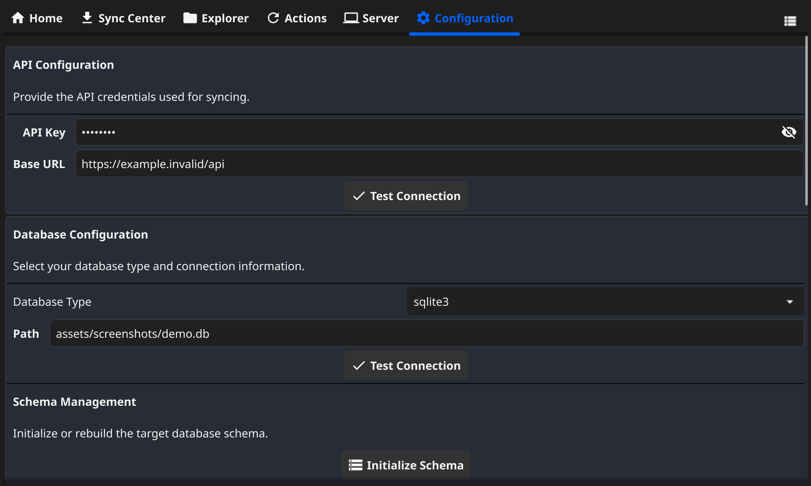
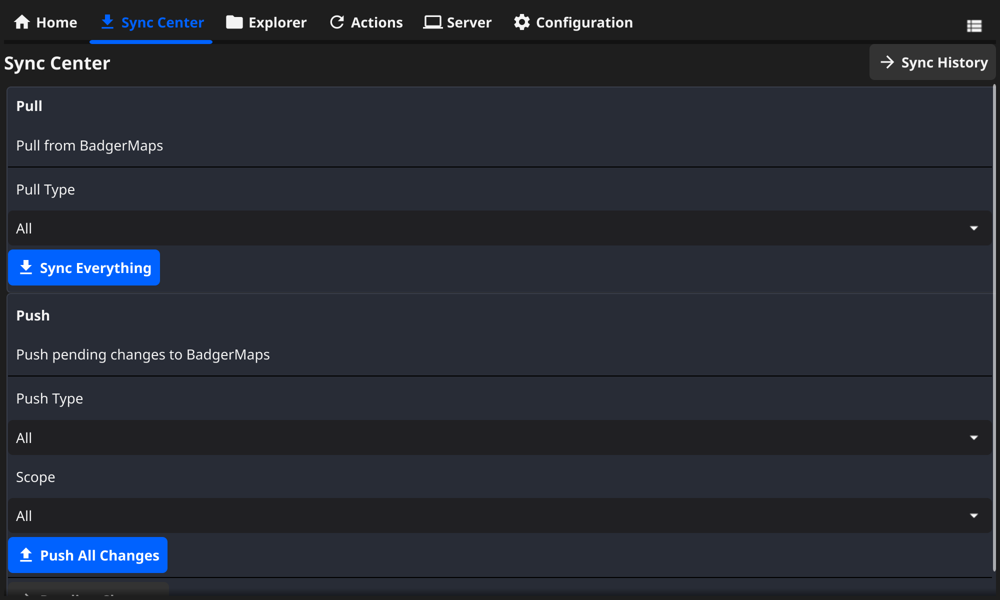
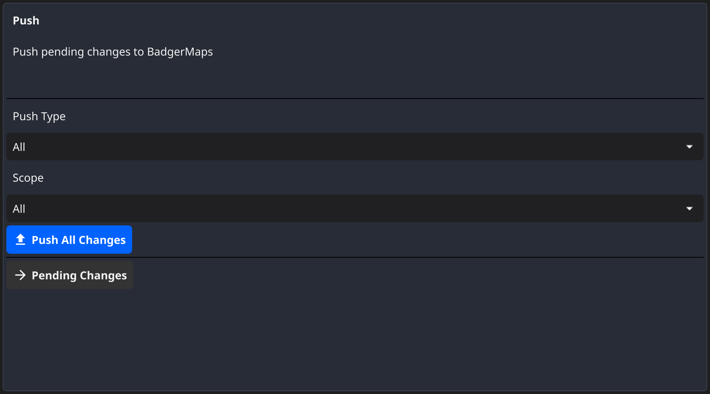
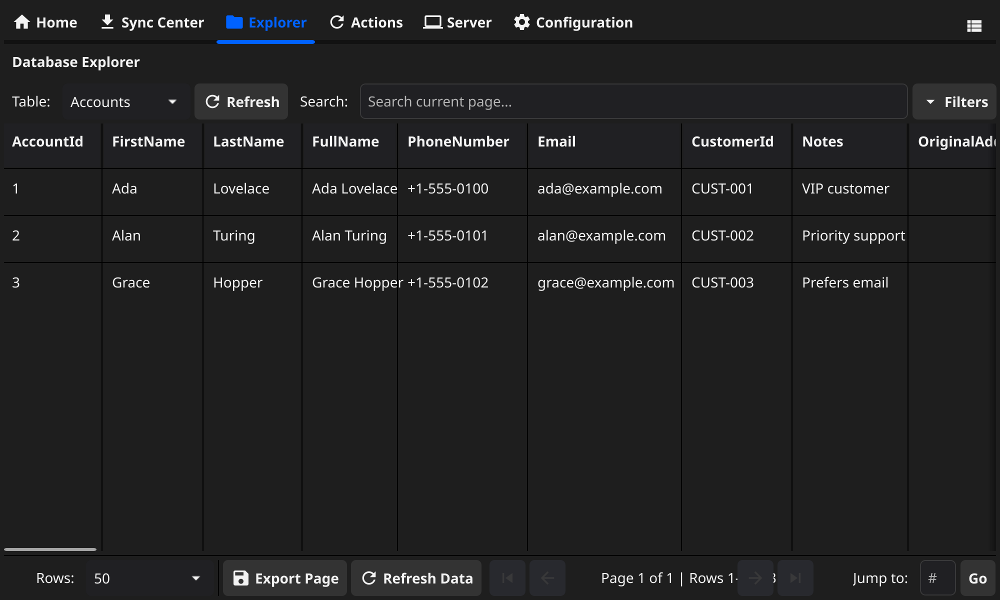
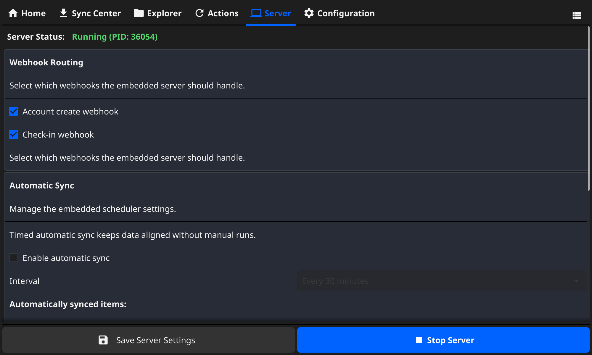

# BadgerMapsSync

BadgerMapsSync is a command-line interface (CLI) and graphical user interface (GUI) for interacting with the BadgerMaps API. It allows you to synchronize data between the BadgerMaps API and a local database, providing a powerful tool for managing customer accounts, routes, check-ins, and user profiles.

## Features

-   **Two-Way Data Sync**: Pull data from the BadgerMaps API to a local database and push local changes back to the API.
-   **Multiple Database Backends**: Supports SQLite, PostgreSQL, and Microsoft SQL Server.
-   **Webhook Server**: Run in server mode to listen for real-time updates from BadgerMaps webhooks.
-   **Event-Driven Actions**: Configure custom actions to be triggered by specific events (e.g., `PullComplete`, `PushComplete`).
-   **Cross-Platform GUI**: A user-friendly graphical interface built with Fyne for managing data and configurations.
-   **Interactive Setup**: An interactive configuration wizard to get you started quickly.

## Supported Databases

-   **SQLite**: Default, lightweight, and file-based.
-   **PostgreSQL**: Powerful, open-source object-relational database.
-   **Microsoft SQL Server (MSSQL)**: Enterprise-grade relational database.

## GUI

The application includes a graphical user interface (GUI) built with the Fyne toolkit, providing a user-friendly way to interact with its features.

### GUI Features

- **Pull**: Pull data from the BadgerMaps API, either all at once or by specific IDs.
- **Push**: Push local changes to the BadgerMaps API.
- **Explorer**: A database explorer to view the contents of the local database. Supports per-column menus (sort/filter), resizable columns, and quick presets.
- **Server**: Configure and start the webhook server (TLS, host/port, request logging).
- **Configuration**: Configure API credentials, database settings, and application preferences.
- **Debug**: Inspect debug information.
- **Log View + Details**: Real‑time logs with a right‑pane details viewer.

### Screenshots

Below are example views using dummy data. If the images don’t render in your environment yet, follow the steps in “Demo Data & Screenshots” to generate them.

| View | Screenshot |
|------|------------|
| Home/Dashboard |  |
| Configuration |  |
| Sync Center — Pull |  |
| Sync Center — Push |  |
| Explorer — Accounts |  |
| Server |  |

> Tip: All images are referenced from `assets/screenshots/`. You can replace them with your own screenshots or generate demo screenshots by following the steps below.

## Building and Running

### Building the Project

To build the project, you need to have Go installed. Then, run the following command from the project's root directory:

```bash
go build -o badgermaps
```

This will create an executable file named `badgermaps` in the project's root directory.

### Running the Project

To run the project, you can use the following command:

```bash
./badgermaps [command]
```

Replace `[command]` with one of the available commands. You can see the list of available commands by running:

```bash
./badgermaps --help
```

To run the GUI, use the `gui` command:

```bash
./badgermaps gui
```

HiDPI/Retina window scaling (GUI)

- Launch the GUI at a larger logical size and proportionally widen the details pane using an environment variable.
- Examples:

```bash
# 2× logical window size (details pane scales as well)
BM_GUI_SCALE=2 ./badgermaps gui

# 1.5× size
BM_GUI_SCALE=1.5 ./badgermaps gui
```

### Running Tests

To run the tests, you can use the following command:

```bash
go test ./...
```

## Development Conventions

### Building After Changes

After making any changes to the code, it is recommended to build the project to ensure that the changes have not introduced any compilation errors.

```bash
go build -o badgermaps
```

### Testing Conventions

Before building the project, it is recommended to run the tests to ensure that the changes have not introduced any regressions.

```bash
go test ./...
```

### Shared Logic

To avoid code duplication, both the `gui` and `cmd` packages should utilize shared helper methods and data structures from the `app` package. This ensures that core business logic is decoupled from the user interface.

### Configuration Management

The project follows a modular approach to configuration management. Each major component (e.g., `api`, `database`, `server`) is responsible for managing its own configuration settings. The `gui` and `cmd` packages should not set configuration keys directly but should interact with the configuration through the `app.App` instance.

## Demo Data & Screenshots

You can quickly spin up the GUI with dummy data and capture screenshots for documentation or testing.

### 1) Prepare a fresh SQLite database

```bash
rm -f test.db
go build -o badgermaps
./badgermaps gui
# In the GUI, set DB type = sqlite3 and DB path = ./test.db, then Initialize Schema.
```

Alternatively, from the CLI you can initialize the schema by running the app once and choosing initialization in the setup wizard, or programmatically through the test harness.

### 2) Load demo data (SQLite)

Option A — small sample: `docs/demo.sql`

```bash
sqlite3 test.db < docs/demo.sql
```

Option B — bulk generator for richer screenshots: `scripts/reseed_demo.sh`

```bash
./scripts/reseed_demo.sh test.db
# Optional volume overrides:
# BULK_ACCOUNTS=500 BULK_ROUTES=120 CHECKINS_PER=3 SYNC_RUNS=80 ./scripts/reseed_demo.sh test.db
```

This seeds Accounts, Routes, AccountCheckins, and SyncHistory so the Explorer and Sync Center look populated.

### 3) Launch the GUI and capture screenshots

```bash
./badgermaps gui
```

Then capture the following views and save them under `assets/screenshots/` with the suggested names:

- `home.png` — Home/Dashboard
- `config.png` — Configuration
- `sync-pull.png` — Sync Center (Pull)
- `sync-push.png` — Sync Center (Push)
- `explorer-accounts.png` — Explorer showing Accounts table
- `server.png` — Server tab

These filenames are already referenced by the README table above.

High‑Resolution (Retina) screenshots

- You can auto‑generate high‑resolution screenshots using the headless tool in `scripts/generate_screenshots.go`.
- By default, images are rendered at 2× scale (retina‑style). Override with `SCALE` if needed.

```bash
# Generate screenshots at 2× scale (default)
go run scripts/generate_screenshots.go

# Generate screenshots at 3× scale
SCALE=3 go run scripts/generate_screenshots.go
```

- Outputs are written to `assets/screenshots/`:
  - `home.png`, `config.png`, `sync-pull.png`, `sync-push.png`, `explorer-accounts.png`, `server.png`
- The helper seeds a demo SQLite database at `assets/screenshots/demo.db` (git‑ignored).

## License

This project is licensed under the terms of the MIT License. See the [LICENSE](LICENSE) file for more details.
