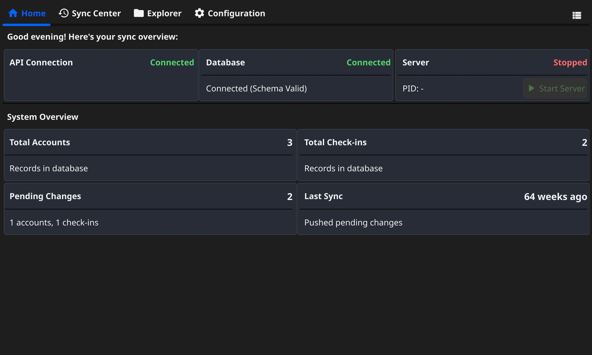
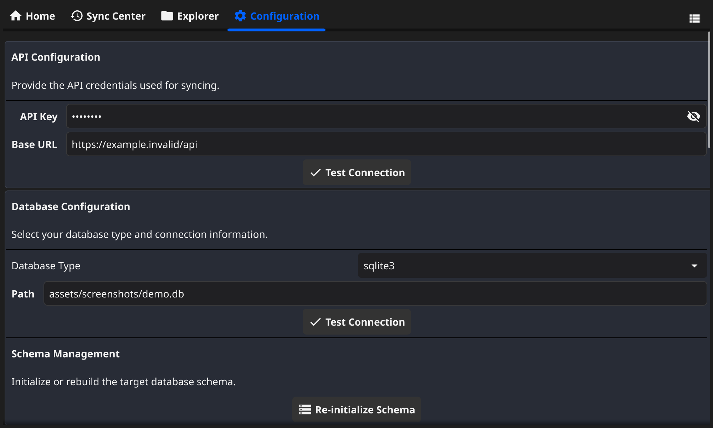
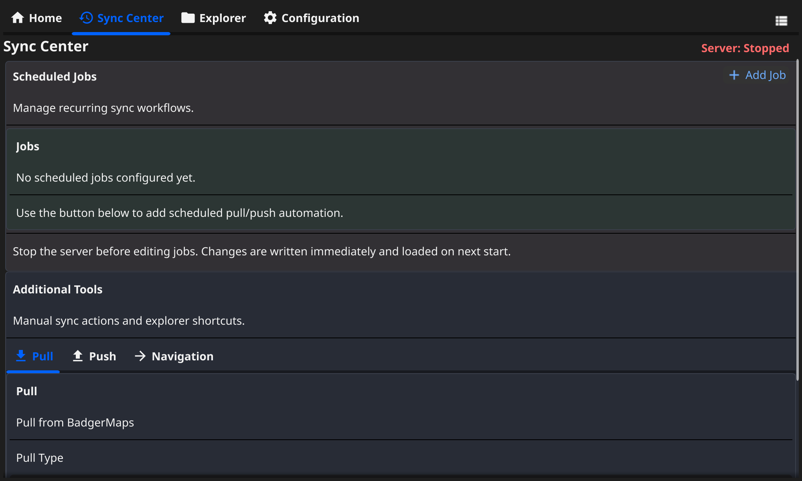
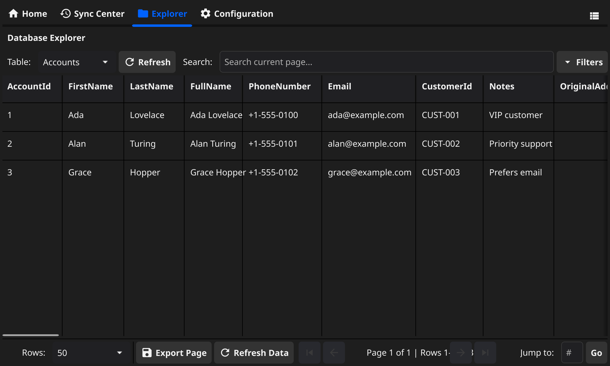

# BadgerMapsSync

BadgerMapsSync is a command-line interface (CLI) and graphical user interface (GUI) for interacting with the BadgerMaps API. It allows you to synchronize data between the BadgerMaps API and a local database, providing a powerful tool for managing customer accounts, routes, check-ins, and user profiles.

## Features

-   **Two-Way Data Sync**: Pull data from the BadgerMaps API to a local database and push local changes back to the API.
-   **Multiple Database Backends**: Supports SQLite, PostgreSQL, and Microsoft SQL Server.
-   **Webhook Server**: Run in server mode to listen for real-time updates from BadgerMaps webhooks, with signed webhook validation.
-   **Timezone-Aware Scheduling**: Configure a global server timezone and optional per-job overrides for scheduled jobs.
-   **Event-Driven Actions**: Configure custom actions to be triggered by specific events (e.g., `PullComplete`, `PushComplete`).
-   **Cross-Platform GUI**: A user-friendly graphical interface built with Fyne for managing data and configurations.
-   **Interactive Setup**: An interactive configuration wizard to get you started quickly.

## Supported Databases

-   **SQLite**: Default, lightweight, and file-based.
-   **PostgreSQL**: Powerful, open-source object-relational database.
-   **Microsoft SQL Server (MSSQL)**: Enterprise-grade relational database.

## GUI

The application includes a graphical user interface (GUI) built with the Fyne toolkit, providing a user-friendly way to interact with its features.

### GUI Features

- **Sync Center**: Run manual pull/push actions, manage scheduled jobs, and start/stop the embedded server with runtime job visibility.
- **Explorer**: A database explorer to view the contents of the local database. Supports per-column menus (sort/filter), resizable columns, and quick presets.
- **Configuration**: Configure API credentials, database settings, server settings (host/port/timezone/TLS/webhook secret/internal API token/logging), webhook routing, config save location, and application preferences.
- **Debug**: Inspect debug information.
- **Log View + Details + Jobs**: Real-time logs, details, and active/queued server jobs in the right-pane slide-out.

### Server and Timezone

For detailed server scheduling and timezone behavior, including cron format, job timezone precedence, and sync history timezone fields, see [Server and Timezone Guide](docs/server-timezone.md).

### Screenshots

Below are example views using dummy data. If the images don’t render in your environment yet, follow the steps in “Demo Data & Screenshots” to generate them.

| View | Screenshot |
|------|------------|
| Home/Dashboard |  |
| Configuration |  |
| Sync Center — Pull |  |
| Sync Center — Push |  |
| Explorer — Accounts |  |

> Tip: All images are referenced from `assets/screenshots/`. You can replace them with your own screenshots or generate demo screenshots by following the steps below.

## Building and Running

### Building the Project

To build the project, you need to have Go installed. Then, run the following command from the project's root directory:

```bash
go build -o badgermaps
```

This will create an executable file named `badgermaps` in the project's root directory.

### Running the Project

To run the project, you can use the following command:

```bash
./badgermaps [command]
```

Replace `[command]` with one of the available commands. You can see the list of available commands by running:

```bash
./badgermaps --help
```

To run the GUI, use the `--gui` flag:

```bash
./badgermaps --gui
```

### Configuration File Location

Config lookup order is:

1. `--config <path>`
2. `config.yaml` beside the executable
3. `./config.yaml` in the current working directory
4. User config path (`~/.config/badgermaps/config.yaml` on macOS/Linux, `%LOCALAPPDATA%\\badgermaps\\config.yaml` on Windows)

In the GUI Configuration tab and setup wizard, `Save Location` lets you choose:

- `User Config` (user config directory)
- `Global` (`config.yaml` beside the executable)

### Running Tests

To run the tests, you can use the following command:

```bash
go test ./...
```

## Development Conventions

### Building After Changes

After making any changes to the code, it is recommended to build the project to ensure that the changes have not introduced any compilation errors.

```bash
go build -o badgermaps
```

### Testing Conventions

Before building the project, it is recommended to run the tests to ensure that the changes have not introduced any regressions.

```bash
go test ./...
```

### Shared Logic

To avoid code duplication, both the `gui` and `cmd` packages should utilize shared helper methods and data structures from the `app` package. This ensures that core business logic is decoupled from the user interface.

### Configuration Management

The project follows a modular approach to configuration management. Each major component (e.g., `api`, `database`, `server`) is responsible for managing its own configuration settings. The `gui` and `cmd` packages should not set configuration keys directly but should interact with the configuration through the `app.App` instance.

## Demo Data & Screenshots

For demo-data seeding and screenshot generation workflows, see [Demo Data & Screenshots](docs/demo-screenshots.md).

## License

This project is licensed under the terms of the MIT License. See the [LICENSE](LICENSE) file for more details.
