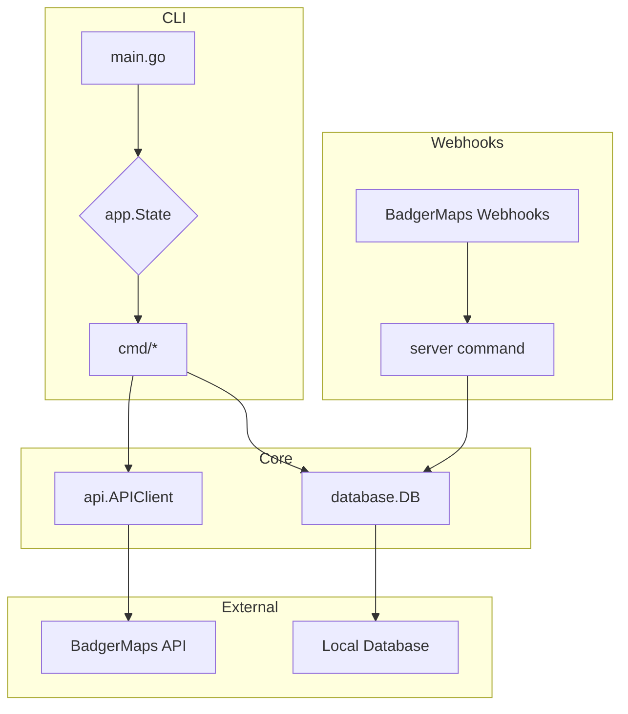

# Architecture and Dataflow

This document provides an overview of the BadgerMaps CLI's architecture and dataflow. For more detailed information on specific modules, please refer to the following documents:

- [Database Module](./DATABASE.md)
- [API Module](./API.md)
- [CMD Modules](./CMD.md)
- [README](../README.md)

## High-Level Overview

The BadgerMaps CLI is a Go application built using the Cobra library. It follows a modular architecture, with distinct packages responsible for different aspects of the application's functionality.

The core components of the application are:

- **`main.go`**: The entry point of the application. It initializes the application state and registers the CLI commands.
- **`app` package**: Contains the core application logic, including state management and configuration.
- **`cmd` package**: Implements the various CLI commands (`pull`, `push`, `server`, etc.).
- **`database` package**: Provides a database abstraction layer with support for SQLite, PostgreSQL, and MSSQL.
- **`api` package**: Contains the client for interacting with the BadgerMaps API.
- **`utils` package**: Contains utility functions used across the application.

## Dataflow

The application's dataflow is centered around the `app.State` struct, which holds the application's configuration and provides access to the API client and database interface.

### 1. Initialization

- When the application starts, `main.go` initializes the `app.State`.
- The configuration is loaded from a `config.yaml` file using Viper.
- The `database.DB` and `api.APIClient` interfaces are initialized based on the configuration.

### 2. Command Execution

- Cobra parses the command-line arguments and executes the corresponding command from the `cmd` package.
- Each command receives the `app.State` as a dependency, giving it access to the API client and database.

### 3. Data Pull (`pull` command)

- The `pull` command uses the `api.APIClient` to fetch data from the BadgerMaps API (e.g., accounts, check-ins, routes).
- The fetched data is then mapped to the local database models.
- The `database.DB` interface is used to store the data in the local database. SQL commands for merging data are used to prevent duplicates.

### 4. Data Push (`push` command)

- The `push` command reads pending changes from the local database.
- It uses the `api.APIClient` to send the changes to the BadgerMaps API.
- Once the changes are successfully pushed, the pending changes in the local database are marked as processed.

### 5. Server Mode (`server` command)

- The `server` command starts an HTTP server that listens for webhooks from BadgerMaps.
- When a webhook is received, the server processes the payload and updates the local database accordingly.
- This allows for real-time synchronization of data between BadgerMaps and the local database.

## Diagram

