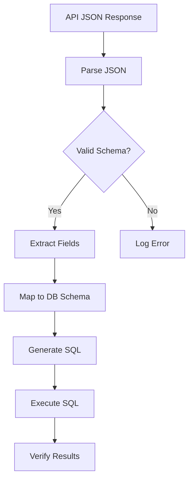
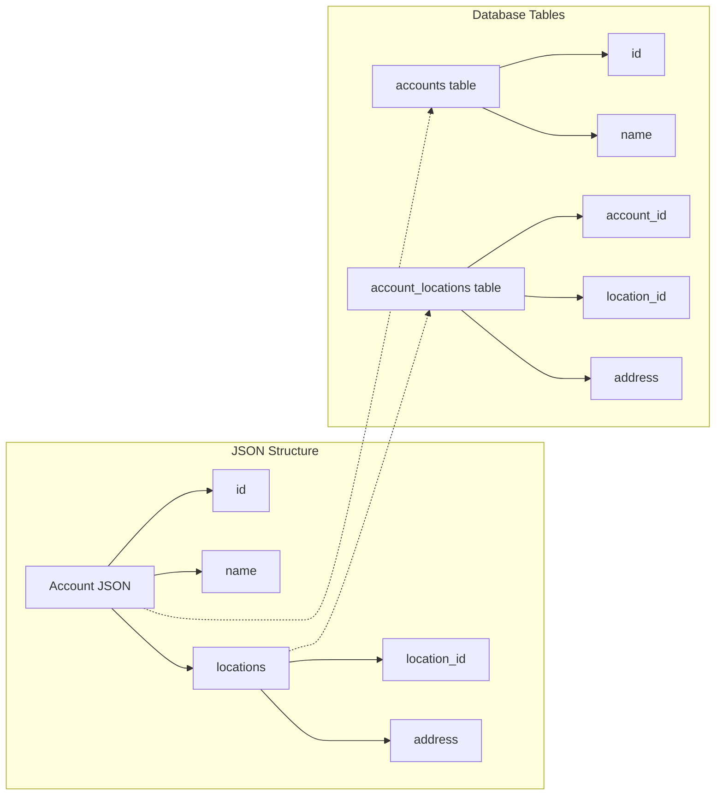

# BadgerMaps CLI - Application Structure

## 1. Command Structure

### Main Commands
- `push`: Send data to BadgerMaps API
- `pull`: Retrieve data from BadgerMaps API
- `server`: Run in server mode
- `test`: Run tests and diagnostics
- `utils`: Utility commands for maintenance
- `auth`: Authenticate with the API
- `search`: Find items by name
- `autocomplete`: Generate shell autocompletion scripts
- `config`: Configure the application
- `help`: Display help information
- `version`: Display version information

### Command Syntax
- Single item operations: `pull account 208965638`
- Multiple item operations: `pull accounts 208965638 208965639`
- Bulk operations: `pull accounts` or `pull account all` (retrieves all accounts)

### Singular vs Plural Data Types
- Singular form (e.g., `account`): Operate on a specific item by ID
- Plural form (e.g., `accounts`): Retrieve a list of all items, then sync detailed data

### Global Flags
- Global flags apply to all commands and provide consistent behavior across the application
- `--verbose` or `-v`: Enable verbose output with additional details
- `--quiet` or `-q`: Suppress all non-essential output
- `--debug`: Enable debug mode with maximum verbosity
- `--no-color`: Disable colored output
- Global flags should be processed before command-specific flags
- Exit with appropriate status codes on errors (0 for success, non-zero for failures)

## 2. Data Types and Operations

### Supported Data Types
- `account`: Customer account information
- `checkin`: Sales visit tracking
- `route`: Route planning data
- `profile`: User profile data

### Pull/Push Operations
- Before executing pull/push commands, validate database tables exist with correct fields
- If validation fails:
  - Exit the program with an error message
  - Provide a suggestion to fix using the utils command

### Concurrent Processing
- For bulk operations, use goroutines for parallel processing
- Limit concurrent operations based on environment configuration (up to 10)
- Implementation pattern:
  - Create a function to process a single item (e.g., `PullAccount`)
  - Create a function to process multiple items (e.g., `PullAccounts`)
  - The bulk function should start goroutines for each item, using the single item function

## 3. API and Database Integration

### API Endpoints
- All endpoint URLs should be created using api_endpoints.go with methods for each endpoint
- If you need to add a new endpoint, add it to the api_endpoints.go file
- Centralize all API URL construction in one place for easier maintenance
- Follow RESTful API design principles for endpoint naming

### JSON to Database Conversion
- JSON responses from the API are converted to database tables using a structured approach
- The following Mermaid diagrams illustrate the conversion process:





### Rate Limit Handling
- Implement exponential backoff with jitter for API requests
- Respect the Retry-After header when provided by the API
- Maintain a maximum retry budget per operation
- Backoff algorithm:
  - Start with a base delay (e.g., 1 second)
  - After each failure, multiply delay by a factor (e.g., 2)
  - Add random jitter (±20%) to prevent thundering herd problem
  - Cap at a maximum delay (e.g., 60 seconds)
- Track rate limit headers from API responses
- Provide clear feedback during rate limiting events
- Log all rate limit encounters when in verbose mode

### SQL Files Management
- SQL files are stored in the database folder depending on the type of database
- Organize SQL files in subdirectories: database/postgres, database/mssql, database/sqlite3
- Each database type has its own implementation of common SQL operations
- Use the SQLLoader to load the appropriate SQL file based on the configured database type

## 4. Configuration and Authentication

### Configuration
- Implement `config` command to configure the application
- Use `viper` package to manage configuration
- .env should be the preferred method for storing configurations
- If no .env file exists, create one
- Allow for rate limiting, parallel processing limits, and server configurations to be defined in the env file with defaults:
  - `RATE_LIMIT_REQUESTS`: Maximum number of API requests per time period
  - `RATE_LIMIT_PERIOD`: Time period for rate limiting in seconds
  - `MAX_PARALLEL_PROCESSES`: Maximum number of concurrent operations
  - `SERVER_HOST`: Host address for server mode
  - `SERVER_PORT`: Port number for server mode
  - `SERVER_TLS_ENABLED`: Enable/disable TLS for server

### Configuration Precedence
- Implement a clear precedence order for configuration sources:
  1. Command-line flags (highest priority)
  2. Environment variables
  3. Configuration file (.env)
  4. Default values (lowest priority)
- Document this precedence in help text and documentation
- When a configuration value is set in multiple places, use the highest priority source
- Provide a way to view the effective configuration with source information
- Allow overriding specific configuration values with flags while keeping others from config file
- Support namespaced environment variables (e.g., `BADGERMAPS_API_URL`)

### Secrets Management
- Store sensitive information like API tokens securely
- Support multiple storage options for secrets:
  1. Environment variables (recommended for CI/CD environments)
  2. OS keychain/credential store (recommended for desktop use)
  3. Configuration file with restricted permissions (fallback)
- Implement automatic redaction of secrets in logs and error messages
- Replace sensitive values with `[REDACTED]` in all output
- Provide a `--no-redact` flag for debugging purposes (with appropriate warnings)
- Implement secure input for secrets when configuring via interactive prompt
- Support rotation of API tokens with minimal downtime
- Validate secrets before storing them

### Authentication
- Use `auth` command to validate and store the API token
- Authentication is required before executing API operations
- Support multiple authentication methods (token, OAuth)
- Implement token refresh mechanism for OAuth authentication
- Provide clear error messages for authentication failures

## 5. Server and Webhook Features

### Server Mode and Webhooks
- Implement server mode with the `server` command
- Listen for incoming webhooks from BadgerMaps API
- Support the following webhook endpoints:
  - `/webhook/account`: Process account updates
  - `/webhook/checkin`: Process check-in updates
  - `/webhook/route`: Process route updates
  - `/webhook/profile`: Process profile updates
- Implement webhook authentication using shared secrets
- Validate webhook payloads before processing
- Support configurable port and host settings
- Provide TLS/HTTPS support for secure webhook endpoints
- Log all webhook requests and responses
- Implement rate limiting for webhook endpoints
- Support webhook retry mechanism for failed processing

### Scheduling
- Implement built-in scheduler with cron-like syntax
- Allow scheduling of any command using the `--schedule` flag
- Example: `server --schedule "0 */6 * * *"` to run server every 6 hours
- Support standard cron syntax with five fields (minute, hour, day of month, month, day of week)
- Provide human-readable schedule descriptions when starting scheduled tasks
- Log all scheduled task executions with timestamps
- Allow cancellation of scheduled tasks with SIGINT (Ctrl+C)
- Implement schedule validation to prevent invalid cron expressions
- Support special time strings like `@hourly`, `@daily`, `@weekly`, `@monthly`
- Maintain a persistent schedule store to survive application restarts

## 6. Search and Autocomplete Features

### Search Functionality
- Implement `search` command to find items by name
- Support searching in accounts and profiles
- Support both offline and online modes
  - Default to offline mode using cached data
  - Provide option to force online mode for real-time data
- Use SQLite database for caching search results
  - Share cache with autocomplete functionality
  - Update cache in background if data is older than one day

### Autocomplete
- Implement shell autocompletion scripts
- Use `bash-completion` package
- Use `cobra` package to generate shell completion scripts
- Implement caching using SQLite database for autocomplete data
  - Store last updated timestamp for each data type
  - Run background update routine if data is older than one day when searching or autocompleting
  - Use embedded SQLite database for offline storage of autocomplete data
- Support both offline and online modes:
  - Default to offline mode using cached data
  - Provide option to force online mode for real-time data
- Display progress bar during data downloads
  - Use the length of the list to show accurate progress
  - Show percentage complete during download operations

### Shell Completion
- Provide built-in shell completion support for multiple shells:
  - Bash: Generate completion script with `autocomplete bash`
  - Zsh: Generate completion script with `autocomplete zsh`
  - Fish: Generate completion script with `autocomplete fish`
  - PowerShell: Generate completion script with `autocomplete powershell`
- Include detailed installation instructions for each shell
- Support both temporary and permanent installation options
- For Bash:
  ```bash
  # Temporary
  source <(badgermaps autocomplete bash)
  
  # Permanent
  badgermaps autocomplete bash > /etc/bash_completion.d/badgermaps
  ```
- For Zsh:
  ```zsh
  # Temporary
  source <(badgermaps autocomplete zsh)
  
  # Permanent
  badgermaps autocomplete zsh > "${fpath[1]}/_badgermaps"
  ```
- For Fish:
  ```fish
  # Temporary
  badgermaps autocomplete fish | source
  
  # Permanent
  badgermaps autocomplete fish > ~/.config/fish/completions/badgermaps.fish
  ```
- For PowerShell:
  ```powershell
  # Temporary
  badgermaps autocomplete powershell | Out-String | Invoke-Expression
  
  # Permanent
  badgermaps autocomplete powershell > badgermaps.ps1
  ```

### Autocomplete Self-Installation
- Implement `autocomplete install` command for automatic installation
- Detect the current shell automatically
- Prompt for confirmation before installation
- Example: `badgermaps autocomplete install`
- Show clear success/failure messages after installation
- Support `--force` flag to skip confirmation
- Support `--shell` flag to specify shell type manually
- Verify installation path exists and is writable
- Create directories if needed (with confirmation)
- Provide rollback in case of installation failure
- Add uninstall option: `autocomplete uninstall`

## 7. User Interface and Feedback

### Terminal Colors
- Use colors in terminal output to improve readability and highlight important information
- Implement consistent color scheme across the application:
  - Green: Success messages and completed operations
  - Yellow: Warnings and important notices
  - Red: Errors and failures
  - Blue: Informational messages and headers
  - Cyan: Progress indicators and status updates
- Respect the `--no-color` flag to disable colored output
- Use bold and underline formatting for emphasis where appropriate
- Ensure colors are compatible with both light and dark terminal themes
- Implement graceful fallback for terminals that don't support colors

### Error Messages
- Provide clear, actionable error messages
- Include error codes for easier troubleshooting
- For common errors, suggest possible solutions
- Log detailed error information when verbose mode is enabled
- Use proper exit codes to indicate the type of failure:
  - 0: Success
  - 1: General error
  - 2: Misuse of shell builtins
  - 3: Command line parsing error
  - 4: Authentication failure
  - 5: API error
  - 6: Database error
  - 7: Network error
  - 8: Rate limit exceeded
  - 9: Timeout error

### Help Command
- Implement context-sensitive help with `help [command]` syntax
- Display general help when `help` is used without arguments
- For specific commands, show detailed usage, examples, and available flags
- Include a `--verbose` or `-v` flag for more detailed help information

## 8. Development and Testing

### Documentation Structure
- Implement comprehensive documentation using Markdown format
- Organize documentation into categories: Getting Started, Commands, Configuration, Troubleshooting
- Include examples for common use cases in each section
- Maintain a separate CHANGELOG.md file for version history
- There should be a documentation page for each module (e.g., api, database)
- Make a man page available for Unix-like systems
  - Generate man page from command documentation
  - Support standard man page sections (NAME, SYNOPSIS, DESCRIPTION, etc.)
  - Install to standard man page location during package installation
  - Allow viewing with `man badgermaps` command

### Compilation Options
- Allow for a compiling option that includes the SQL files in the binary
- Implement embedding of SQL files for easier deployment
- Provide fallback to file system if embedded files are not available
- Use build tags to control whether SQL files are embedded or loaded from disk

### Testing Features
- `test -s` flag should save API response body to a text file
- Use for debugging and verification purposes

### Database Testing
- When testing, create a new SQLite database in the badgermaps__test/ folder
- Use isolated test databases to prevent interference with production data

### Test Responses
- When saving any responses from tests, save them in the badgermaps__test/ folder
- Organize test responses by feature or endpoint for easier debugging
- Include timestamp in filenames for tracking test execution history

API URL = https://badgerapis.badgermapping.com/api/2